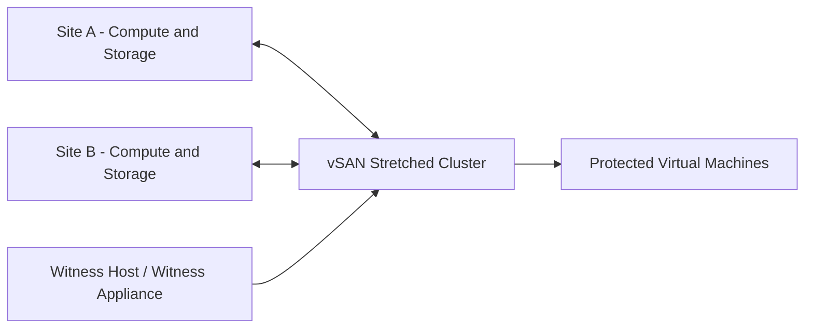

# ADR-001: Use vSAN Stretched Cluster for Site-Level Resilience

## Status

Accepted as a reference architecture pattern.

## Context

Enterprise workloads often require high availability across two physical locations or failure domains.

In traditional infrastructure designs, storage and compute failures at one site can cause application downtime unless workloads are replicated or stretched across sites.

For regulated or mission-critical environments, the architecture must reduce recovery time and support predictable failover behavior.

## Decision

Use a vSAN stretched cluster pattern across two sites or failure domains, with a witness component placed in a third independent location or failure domain.

The design provides shared storage availability across sites and allows virtual machines to remain protected during certain site-level failures.

## Architecture pattern

## Why this decision?

vSAN stretched cluster was selected because it can provide:

* Site-level resilience
* Storage policy-based management
* Integration with VMware vSphere
* Simplified operational model compared with separate storage replication tools
* Better alignment with VMware Cloud Foundation (VCF) based environments

## Alternatives considered

### Traditional storage replication

Pros:

* Mature technology
* Often supported by enterprise storage vendors

Cons:

* More dependency on external storage systems
* More complex failover operations
* Separate management layer

### Application-level replication

Pros:

* Good for cloud-native applications
* Flexible across platforms

Cons:

* Requires application support
* Not suitable for every legacy workload
* More complex for mixed enterprise environments

### Backup-only recovery

Pros:

* Lower cost
* Simple operational model

Cons:

* Higher recovery time
* Not suitable for critical workloads requiring fast failover

## Trade-offs

### Benefits

* Stronger resilience for critical virtual machines
* Policy-based storage control
* Integrated VMware operational model
* Suitable for private cloud and regulated environments

### Limitations

* Requires careful network latency design
* Witness placement is critical
* Split-brain protection must be understood
* Operational procedures must be documented and tested
* Not a replacement for backup

## Operational considerations

* Monitor inter-site latency
* Validate witness connectivity
* Test failover and recovery procedures
* Define storage policies per workload tier
* Combine with backup and disaster recovery strategy
* Avoid treating stretched clustering as a full disaster recovery solution

## Security and confidentiality note

This document is a sanitized public reference pattern.

It does not include real site names, IP addresses, hostnames, customer data, or private enterprise diagrams.
