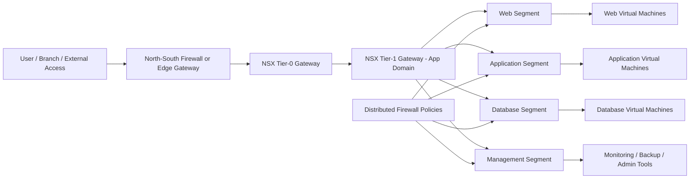

# ADR-002: Use NSX Network Segmentation for East-West Traffic Control

## Status

Accepted as a reference architecture pattern.

## Context

Enterprise private cloud environments often host many application tiers, business services, management components, and shared infrastructure workloads on the same virtualization platform.

Without strong segmentation, lateral movement risk increases. A compromise in one workload zone can potentially expose other systems.

Traditional perimeter firewalls are useful for north-south traffic, but they are not enough for controlling east-west communication between workloads inside the data center.

## Decision

Use VMware NSX network segmentation to separate workloads into logical security zones and control east-west traffic between application tiers.

The reference pattern uses logical segments, distributed firewall rules, security groups, and tiered routing to enforce traffic control close to the workload.

## Architecture pattern

## Why this decision?

NSX was selected because it provides:

* Micro-segmentation close to the workload
* Distributed firewall enforcement at the virtual network layer
* Logical networking independent of physical VLAN sprawl
* Better control of east-west traffic
* Strong alignment with VMware Cloud Foundation (VCF) based private cloud design
* More flexible security policy design for multi-tier applications

## Alternatives considered

### Traditional VLAN segmentation

Pros:

* Familiar operational model
* Supported by most network teams
* Simple for smaller environments

Cons:

* Can create VLAN sprawl
* Less flexible for dynamic workloads
* Security enforcement is usually farther from the workload
* More dependency on physical network changes

### Perimeter firewall only

Pros:

* Strong control for north-south traffic
* Centralized inspection point

Cons:

* Weak control over internal east-west traffic
* Lateral movement risk remains
* Not ideal for multi-tenant or multi-application environments

### Host-based firewall only

Pros:

* Close to workload
* Can be application-specific

Cons:

* Harder to manage consistently at scale
* Depends on operating system configuration
* Can become operationally inconsistent

## Trade-offs

### Benefits

* Better workload isolation
* Reduced lateral movement risk
* More flexible security policies
* Easier segmentation for multi-tier applications
* Stronger security model for regulated environments

### Limitations

* Requires clear application dependency mapping
* Incorrect rules can break application communication
* Operations teams need NSX knowledge
* Rule lifecycle management must be disciplined
* Monitoring and troubleshooting processes must be updated

## Operational considerations

* Start with visibility and traffic discovery before enforcement
* Use naming standards for segments and security groups
* Apply least privilege gradually
* Separate management, application, database, and backup traffic
* Document allowed flows per application
* Review firewall rules regularly
* Integrate logging with observability and security monitoring

## Security and confidentiality note

This document is a sanitized public reference pattern.

It does not include real customer names, real IP addresses, hostnames, firewall rules, production diagrams, or confidential network configuration.
