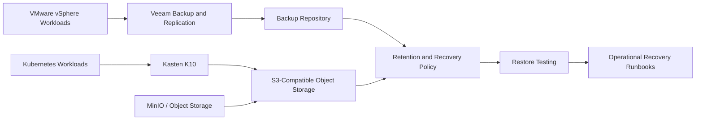

# ADR-003: Use Veeam, Kasten K10, and Object Storage for Hybrid Backup and Recovery

## Status

Accepted as a reference architecture pattern.

## Context

Hybrid cloud environments often include both traditional virtual machine workloads and Kubernetes-based application workloads.

A single backup approach may not cover both environments properly. Virtual machines require image-level backup and recovery, while Kubernetes workloads require namespace, persistent volume, manifest, and application-aware recovery patterns.

In restricted or regulated environments, backup architecture must also consider local object storage, network isolation, retention, restore testing, and operational ownership.

## Decision

Use a layered backup and recovery pattern:

* Veeam for virtual machine backup and recovery
* Kasten K10 for Kubernetes application and namespace-level backup
* MinIO or compatible object storage as an S3-compatible backup target
* Separate backup policies for virtual machines, Kubernetes namespaces, and critical application data

This pattern supports both traditional infrastructure recovery and Kubernetes-native recovery.

## Architecture pattern

## Why this decision?

This decision separates backup responsibilities by workload type.

Veeam is suitable for virtual machine backup and recovery because it aligns well with VMware-based infrastructure operations.

Kasten K10 is suitable for Kubernetes workloads because it understands Kubernetes objects, namespaces, persistent volumes, and application-level backup workflows.

Object storage such as MinIO provides an S3-compatible target that can be used in restricted or private environments where public cloud storage may not be available.

## Alternatives considered

### Veeam only

Pros:

* Strong virtual machine backup capability
* Familiar to infrastructure teams
* Mature recovery workflows

Cons:

* Not enough by itself for Kubernetes-native application recovery
* Does not fully represent namespace, manifest, and persistent volume recovery patterns

### Kubernetes snapshots only

Pros:

* Native to Kubernetes storage systems
* Useful for persistent volume recovery

Cons:

* Not enough for full application recovery
* Does not always include application metadata, policies, and dependencies
* Requires careful storage class and CSI driver support

### Public cloud object storage only

Pros:

* Scalable and managed
* Useful for offsite retention

Cons:

* May not be allowed in restricted or air-gapped environments
* Can introduce dependency on external connectivity
* Requires governance around access, encryption, and data residency

## Trade-offs

### Benefits

* Covers both virtual machine and Kubernetes workloads
* Supports private and restricted environments
* Allows different recovery policies by workload type
* Improves operational clarity between infrastructure and platform teams
* Enables object-storage-based backup targets without depending on public cloud

### Limitations

* More components to operate
* Requires restore testing discipline
* Requires clear ownership between infrastructure and Kubernetes teams
* Object storage must be monitored and protected
* Backup success does not guarantee recovery success unless restores are tested

## Operational considerations

* Define separate backup policies for virtual machines and Kubernetes namespaces
* Test restores regularly
* Document recovery time objectives and recovery point objectives
* Monitor backup job success and storage capacity
* Protect backup repositories from accidental deletion or ransomware
* Keep backup credentials separate from normal admin credentials
* Validate object storage lifecycle and retention policies
* Maintain recovery runbooks for common restore scenarios

## Recovery scenarios

This pattern supports several recovery scenarios:

* Restore a virtual machine from backup
* Restore a Kubernetes namespace
* Restore persistent volume data
* Recover an application after accidental deletion
* Recover from failed upgrade or configuration change
* Rebuild application state from object storage backup

## What this pattern is not

This is not a full disaster recovery strategy by itself.

Backup is only one layer of resilience. It should be combined with:

* High availability design
* Monitoring and alerting
* Tested recovery procedures
* Access control
* Immutable or protected backup storage where possible
* Disaster recovery planning for critical services

## Security and confidentiality note

This document is a sanitized public reference pattern.

It does not include real backup repositories, customer data, hostnames, IP addresses, retention policies, credentials, internal screenshots, or confidential recovery procedures.
