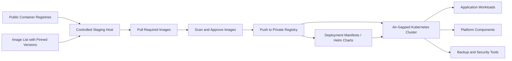

# ADR-004: Use a Private Registry Pattern for Air-Gapped Kubernetes Environments

## Status

Accepted as a reference architecture pattern.

## Context

Restricted enterprise environments often do not allow Kubernetes worker nodes to pull container images directly from the public internet.

This is common in banking, government, defense, and other regulated environments where outbound internet access is limited or blocked.

In this model, container images must be downloaded, reviewed, scanned, approved, and pushed into a private registry before they can be used by Kubernetes clusters.

Without a private registry pattern, deployments become unreliable, hard to repeat, and difficult to secure.

## Decision

Use a private container registry pattern for air-gapped Kubernetes environments.

The design includes:

* A controlled staging host with temporary or approved internet access
* A private registry such as Harbor or Azure Container Registry
* A defined image list with pinned versions
* Image pull, tag, scan, approve, and push workflow
* Kubernetes deployments using only internal registry image references
* Restricted runtime clusters with no direct dependency on public registries

## Architecture pattern

## Why this decision?

A private registry pattern was selected because it provides a controlled and repeatable method for deploying Kubernetes workloads in restricted environments.

It reduces dependency on public internet access and improves control over the software supply chain.

This approach is especially useful for platforms such as:

* Kubernetes core components
* Ingress controllers
* Backup tools such as Kasten K10
* Observability tools
* Internal applications
* Local Generative AI or Retrieval-Augmented Generation workloads

## Alternatives considered

### Direct public image pulls

Pros:

* Simple for development
* Fast to test
* Minimal setup

Cons:

* Not acceptable in air-gapped or restricted environments
* Creates external dependency
* Harder to audit and control
* Public tags may change
* Risk of deployment failure when internet access is unavailable

### Manual image transfer only

Pros:

* Works without permanent internet access
* Simple for small tests

Cons:

* Not scalable
* Error-prone
* Difficult to maintain across versions
* Weak auditability
* Hard to standardize across clusters

### Fully managed public cloud registry only

Pros:

* Managed service
* Good integration with cloud platforms
* Scalable

Cons:

* May not be reachable from isolated environments
* May not satisfy local hosting or data residency requirements
* Requires cloud connectivity and governance

## Trade-offs

### Benefits

* Repeatable deployment process
* Better control of image versions
* Reduced dependency on public internet
* Supports security review and image scanning
* Better fit for regulated and air-gapped environments
* Easier rollback when exact image versions are preserved

### Limitations

* Requires registry operations knowledge
* Requires storage planning for image repositories
* Requires process discipline for version updates
* More operational overhead than direct internet pull
* Image scanning and approval process must be maintained

## Operational considerations

* Pin image versions instead of using `latest`
* Keep an approved image list per platform release
* Scan images before promotion
* Separate staging, approved, and production repositories if possible
* Document image source, version, digest, and approval date
* Protect registry credentials
* Configure Kubernetes imagePullSecrets where required
* Monitor registry storage capacity
* Back up the registry metadata and storage
* Test cluster rebuild using only private registry images

## Example workflow

1. Define required images and versions.
2. Pull images on a controlled staging host.
3. Scan images using the approved security tool.
4. Tag images for the internal registry.
5. Push images into the private registry.
6. Update Kubernetes manifests or Helm values to use internal image paths.
7. Deploy workloads to the restricted cluster.
8. Validate that no public registry access is required.

## Recovery considerations

The private registry becomes a critical platform dependency.

The architecture should include:

* Registry backup
* Storage capacity monitoring
* High availability where required
* Disaster recovery plan for registry outage
* Documented rebuild procedure
* Offline copy of critical platform images

## What this pattern is not

This pattern does not replace Kubernetes security controls.

It should be combined with:

* Role-Based Access Control
* Network policies
* Admission control
* Image signing where possible
* Secrets management
* Vulnerability scanning
* Audit logging

## Security and confidentiality note

This document is a sanitized public reference pattern.

It does not include real registry hostnames, IP addresses, internal image names, credentials, customer data, or confidential platform configuration.
