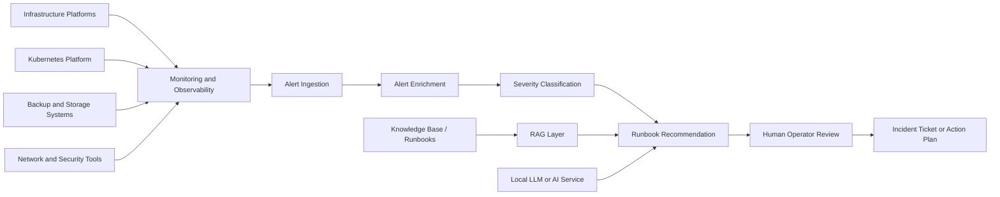

# ADR-005: Use Observability and AIOps Pattern for Infrastructure Incident Triage

## Status

Accepted as a reference architecture pattern.

## Context

Enterprise infrastructure environments generate alerts from many sources, including virtualization platforms, Kubernetes clusters, backup tools, storage systems, network components, and application monitoring systems.

Without a structured observability and triage pattern, operations teams may face:

* Alert noise
* Repeated manual investigation
* Slow incident classification
* Inconsistent runbook usage
* Delayed escalation
* Limited visibility across infrastructure and application layers

In hybrid cloud and private cloud environments, the problem becomes more complex because workloads may span virtual machines, Kubernetes namespaces, backup platforms, and cloud governance layers.

## Decision

Use an observability and AIOps pattern to collect operational signals, enrich alerts, classify severity, and recommend runbook actions.

The reference pattern includes:

* Monitoring and observability tools
* Alert ingestion
* Enrichment layer
* Incident classification
* Runbook recommendation
* Optional local LLM or Retrieval-Augmented Generation layer
* Human review before action

## Architecture pattern

## Why this decision?

This pattern was selected because infrastructure teams need more than raw alerts.

They need context, probable cause, impact assessment, and recommended next steps.

AIOps should not replace operators. It should assist them by reducing manual triage effort and improving consistency.

For restricted environments, local or private model deployment may be preferred over sending operational data to public services.

## Alternatives considered

### Manual triage only

Pros:

* Simple process
* No additional platform required
* Uses existing team knowledge

Cons:

* Slow during high alert volume
* Depends heavily on senior engineers
* Inconsistent runbook usage
* Hard to scale across teams and shifts

### Monitoring dashboard only

Pros:

* Useful for visibility
* Good for metrics and trend analysis
* Familiar to operations teams

Cons:

* Does not automatically explain impact
* Does not classify incidents
* Does not recommend next steps
* Still requires manual investigation

### Fully automated remediation

Pros:

* Fast response
* Useful for known repetitive issues
* Can reduce operational workload

Cons:

* Risky without strong controls
* Wrong action can cause wider outage
* Requires mature testing and approval process
* Not suitable for all regulated environments

## Trade-offs

### Benefits

* Faster incident understanding
* More consistent runbook usage
* Better alert context
* Reduced dependency on tribal knowledge
* Improved handover between teams
* Supports future automation maturity

### Limitations

* Requires clean alert data
* Requires maintained runbooks
* Poor-quality prompts or documents can create poor recommendations
* Human approval is still required
* Model output must be validated
* Sensitive operational data must be protected

## Operational considerations

* Start with read-only recommendations
* Keep humans in the approval loop
* Maintain a trusted runbook library
* Track false positives and bad recommendations
* Avoid sending sensitive infrastructure data to unapproved external services
* Log model inputs and outputs where policy allows
* Define escalation rules clearly
* Integrate with ticketing only after validation
* Measure time-to-triage before and after implementation

## Success criteria

A real implementation should be measured by:

* Reduced mean time to triage
* Fewer repeated manual investigations
* More consistent severity classification
* Better runbook usage
* Reduced alert fatigue
* Improved incident handover quality

This reference document does not claim production metrics.

## What this pattern is not

This is not a replacement for monitoring tools, incident management, or experienced engineers.

It is a decision-support pattern for infrastructure operations.

The safest first version should recommend actions, not execute them automatically.

## Security and confidentiality note

This document is a sanitized public reference pattern.

It does not include real alert data, customer information, private IP addresses, hostnames, internal screenshots, credentials, or confidential operational procedures.
