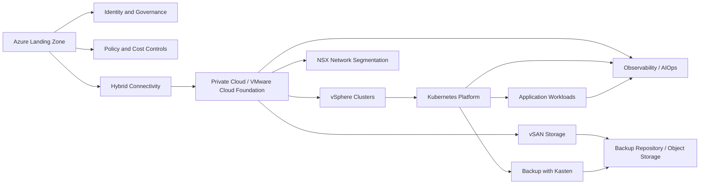

# Hybrid Cloud Overview Diagram

## Purpose

This diagram shows a sanitized hybrid cloud reference pattern connecting private cloud, Kubernetes operations, backup, observability, and public cloud governance concepts.

## Notes

This is a public reference diagram only.

It does not represent any specific production environment.
